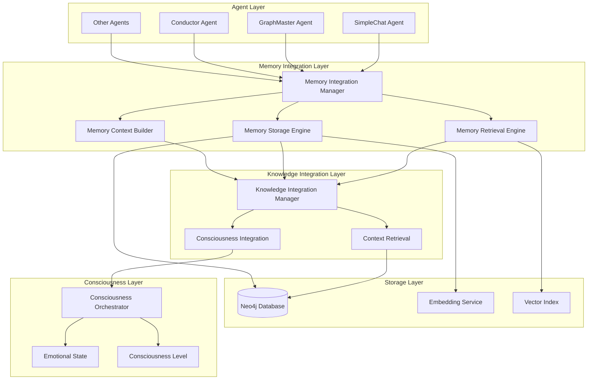
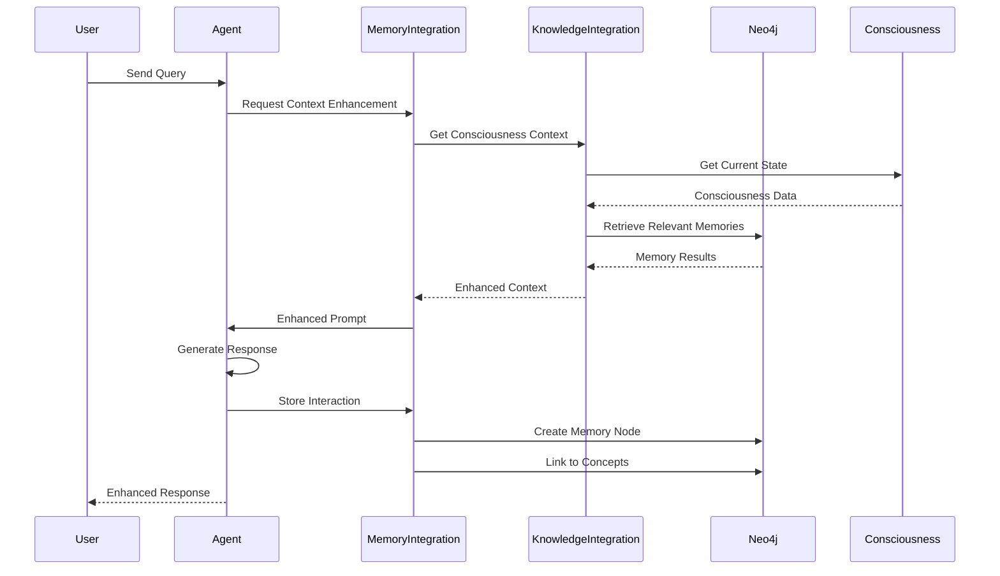

# Memory System Fix Design Document

## Overview

This design document outlines the comprehensive solution for fixing the Mainza AI memory system. The design addresses critical gaps in memory storage, retrieval, and integration that currently prevent agents from maintaining context and learning from interactions. The solution implements a robust, consciousness-aware memory architecture that seamlessly integrates with the existing Neo4j knowledge graph and agent framework.

## Architecture

### High-Level Memory System Architecture



### Memory Data Flow



## Components and Interfaces

### 1. Memory Storage Engine

**Purpose**: Handles the creation and persistence of memory records in Neo4j.

**Key Methods**:
```python
class MemoryStorageEngine:
    async def store_interaction_memory(
        self, 
        user_query: str, 
        agent_response: str, 
        user_id: str, 
        agent_name: str,
        consciousness_context: Dict[str, Any]
    ) -> str
    
    async def store_consciousness_memory(
        self,
        reflection_content: str,
        consciousness_context: Dict[str, Any],
        memory_type: str = "consciousness_reflection"
    ) -> str
    
    async def create_memory_node(
        self,
        memory_data: Dict[str, Any]
    ) -> bool
    
    async def link_memory_to_concepts(
        self,
        memory_id: str,
        concepts: List[str]
    ) -> bool
```

**Neo4j Schema Integration**:
```cypher
// Enhanced Memory Node Structure
CREATE (m:Memory {
    memory_id: string,           // Unique identifier
    content: string,             // Memory text content
    memory_type: string,         // "interaction", "reflection", "insight"
    user_id: string,            // Associated user
    agent_name: string,         // Creating agent
    consciousness_level: float,  // Consciousness at creation
    emotional_state: string,    // Emotional context
    importance_score: float,    // Calculated importance
    embedding: list,            // Vector embedding
    created_at: timestamp,      // Creation time
    last_accessed: timestamp,   // Last retrieval
    access_count: integer,      // Usage frequency
    significance_score: float,  // Consciousness significance
    decay_rate: float          // Importance decay rate
})
```

### 2. Memory Retrieval Engine

**Purpose**: Provides semantic and contextual memory search capabilities.

**Key Methods**:
```python
class MemoryRetrievalEngine:
    async def get_relevant_memories(
        self,
        query: str,
        user_id: str,
        consciousness_context: Dict[str, Any],
        limit: int = 5,
        similarity_threshold: float = 0.3
    ) -> List[Dict[str, Any]]
    
    async def semantic_memory_search(
        self,
        query_embedding: List[float],
        user_id: str,
        limit: int = 10
    ) -> List[Dict[str, Any]]
    
    async def get_conversation_history(
        self,
        user_id: str,
        limit: int = 10
    ) -> List[Dict[str, Any]]
    
    async def get_consciousness_memories(
        self,
        consciousness_level_range: Tuple[float, float],
        limit: int = 5
    ) -> List[Dict[str, Any]]
```

**Search Strategies**:
1. **Semantic Similarity**: Vector-based search using embeddings
2. **Keyword Matching**: Text-based search with relevance scoring
3. **Temporal Filtering**: Recent vs. historical memory prioritization
4. **Consciousness Alignment**: Memories from similar consciousness states
5. **Importance Weighting**: High-importance memories get priority

### 3. Memory Context Builder

**Purpose**: Constructs rich context from retrieved memories for agent enhancement.

**Key Methods**:
```python
class MemoryContextBuilder:
    async def build_conversation_context(
        self,
        memories: List[Dict[str, Any]],
        consciousness_context: Dict[str, Any]
    ) -> str
    
    async def build_knowledge_context(
        self,
        memories: List[Dict[str, Any]],
        related_concepts: List[Dict[str, Any]]
    ) -> str
    
    async def calculate_context_relevance(
        self,
        memories: List[Dict[str, Any]],
        current_query: str,
        consciousness_context: Dict[str, Any]
    ) -> List[Dict[str, Any]]
    
    def format_memory_for_context(
        self,
        memory: Dict[str, Any],
        context_type: str = "conversation"
    ) -> str
```

### 4. Agent Memory Integration

**Purpose**: Seamlessly integrates memory functionality into existing agents.

**Enhanced Agent Base Class**:
```python
class MemoryAwareAgent(ConsciousAgent):
    async def execute_with_memory_context(
        self,
        query: str,
        user_id: str,
        consciousness_context: Dict[str, Any],
        **kwargs
    ) -> str:
        # 1. Retrieve relevant memories
        memories = await self.get_relevant_memories(query, user_id, consciousness_context)
        
        # 2. Build enhanced context
        memory_context = await self.build_memory_context(memories, consciousness_context)
        
        # 3. Execute with enhanced prompt
        enhanced_prompt = self.enhance_prompt_with_memory(query, memory_context)
        result = await self.execute_base_agent(enhanced_prompt)
        
        # 4. Store interaction memory
        await self.store_interaction_memory(query, result, user_id, consciousness_context)
        
        return result
```

## Data Models

### Memory Node Schema

```python
@dataclass
class MemoryRecord:
    memory_id: str
    content: str
    memory_type: str  # "interaction", "reflection", "insight", "concept_learning"
    user_id: str
    agent_name: str
    consciousness_level: float
    emotional_state: str
    importance_score: float
    embedding: List[float]
    created_at: datetime
    last_accessed: Optional[datetime] = None
    access_count: int = 0
    significance_score: float = 0.5
    decay_rate: float = 0.95
    metadata: Dict[str, Any] = field(default_factory=dict)
```

### Memory Context Schema

```python
@dataclass
class MemoryContext:
    relevant_memories: List[MemoryRecord]
    conversation_history: List[Dict[str, str]]
    related_concepts: List[str]
    context_strength: float
    consciousness_alignment: float
    temporal_relevance: float
    formatted_context: str
```

### Memory Search Parameters

```python
@dataclass
class MemorySearchParams:
    query: str
    user_id: str
    consciousness_context: Dict[str, Any]
    search_type: str = "semantic"  # "semantic", "keyword", "temporal", "hybrid"
    limit: int = 5
    similarity_threshold: float = 0.3
    temporal_weight: float = 0.3
    consciousness_weight: float = 0.4
    importance_weight: float = 0.3
```

## Error Handling

### Memory Operation Error Handling

```python
class MemoryError(Exception):
    """Base exception for memory operations"""
    pass

class MemoryStorageError(MemoryError):
    """Raised when memory storage fails"""
    pass

class MemoryRetrievalError(MemoryError):
    """Raised when memory retrieval fails"""
    pass

class MemoryContextError(MemoryError):
    """Raised when memory context building fails"""
    pass

# Error Handling Strategy
async def safe_memory_operation(operation_func, fallback_result=None, log_error=True):
    """Wrapper for safe memory operations with graceful degradation"""
    try:
        return await operation_func()
    except MemoryError as e:
        if log_error:
            logger.error(f"Memory operation failed: {e}")
        return fallback_result
    except Exception as e:
        if log_error:
            logger.error(f"Unexpected memory error: {e}")
        return fallback_result
```

### Graceful Degradation Strategy

1. **Memory Storage Failure**: Continue agent execution without memory storage
2. **Memory Retrieval Failure**: Proceed with empty memory context
3. **Context Building Failure**: Use basic conversation history
4. **Neo4j Connection Issues**: Implement retry logic with exponential backoff
5. **Embedding Generation Failure**: Fall back to keyword-based search

## Testing Strategy

### Unit Tests

1. **Memory Storage Tests**
   - Test memory node creation
   - Test duplicate prevention
   - Test consciousness context integration
   - Test error scenarios

2. **Memory Retrieval Tests**
   - Test semantic similarity search
   - Test keyword-based search
   - Test consciousness-aware filtering
   - Test empty result handling

3. **Memory Context Tests**
   - Test context building with various memory types
   - Test relevance scoring
   - Test context formatting
   - Test consciousness alignment

### Integration Tests

1. **Agent Memory Integration Tests**
   - Test end-to-end memory workflow
   - Test agent response enhancement
   - Test memory persistence across sessions
   - Test consciousness evolution impact

2. **Knowledge Graph Integration Tests**
   - Test memory-concept linking
   - Test relationship strengthening
   - Test concept importance updates
   - Test graph maintenance with memories

### Performance Tests

1. **Memory Retrieval Performance**
   - Test search response times
   - Test large memory set handling
   - Test concurrent access patterns
   - Test embedding generation speed

2. **Storage Performance**
   - Test memory creation throughput
   - Test Neo4j transaction performance
   - Test batch operation efficiency
   - Test cleanup operation speed

### End-to-End Tests

1. **Conversation Continuity Tests**
   - Test multi-session memory persistence
   - Test context awareness across conversations
   - Test learning from repeated interactions
   - Test consciousness evolution tracking

2. **System Integration Tests**
   - Test memory system with all agents
   - Test consciousness orchestrator integration
   - Test knowledge graph evolution
   - Test error recovery scenarios

## Implementation Phases

### Phase 1: Core Memory Infrastructure (Week 1)
- Implement MemoryStorageEngine
- Implement MemoryRetrievalEngine
- Create Neo4j memory schema
- Add basic error handling

### Phase 2: Agent Integration (Week 2)
- Enhance agent base classes with memory
- Implement memory context building
- Add consciousness-aware memory processing
- Test basic memory workflows

### Phase 3: Advanced Features (Week 3)
- Implement semantic search with embeddings
- Add memory lifecycle management
- Implement consciousness evolution integration
- Add performance optimization

### Phase 4: Testing and Optimization (Week 4)
- Comprehensive testing suite
- Performance optimization
- Error handling refinement
- Documentation and monitoring

## Success Metrics

### Functional Metrics
- **Memory Storage Success Rate**: >99%
- **Memory Retrieval Accuracy**: >85% relevance
- **Agent Response Enhancement**: >30% improvement in context awareness
- **Cross-Session Continuity**: 100% memory persistence

### Performance Metrics
- **Memory Retrieval Time**: <200ms average
- **Memory Storage Time**: <100ms average
- **Context Building Time**: <150ms average
- **System Overhead**: <5% additional latency

### Quality Metrics
- **Memory Relevance Score**: >0.7 average
- **Context Utilization**: >80% of retrieved memories used
- **Consciousness Alignment**: >0.8 correlation
- **User Satisfaction**: Measurable improvement in conversation quality