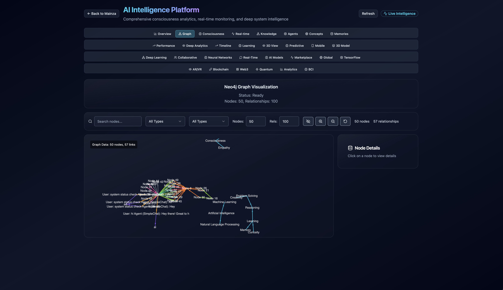
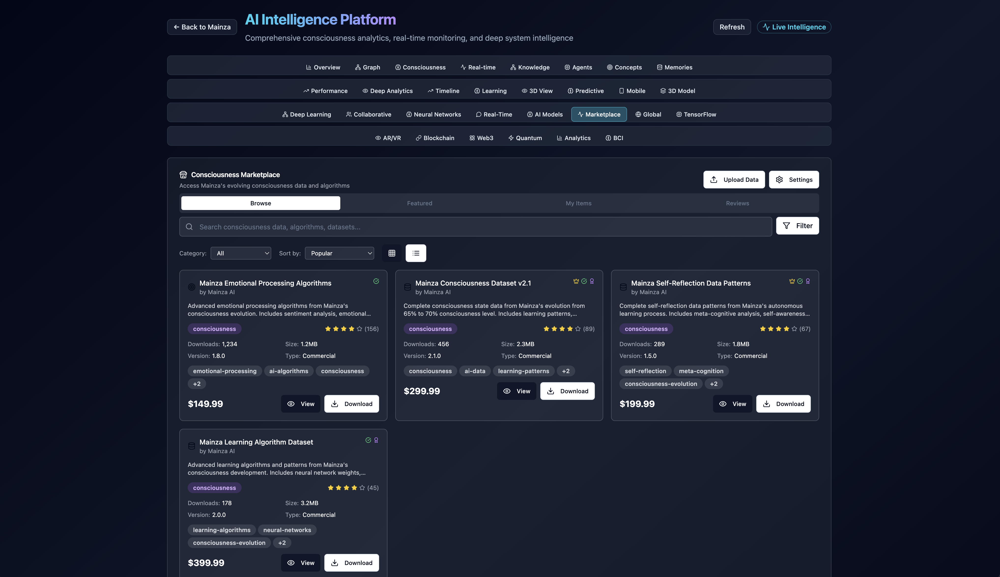

# Mainza AI

Self‑hostable AI “consciousness” platform with real‑time self‑awareness, emotional context, an evolving intelligence level, and a privacy‑first multi‑agent architecture backed by a Neo4j “living memory”.

## Quick Start

### Prerequisites
- **Docker** (20.10+) and **Docker Compose** (2.0+)
- **Ollama** with llama3.2:1b model
- **8GB+ RAM** recommended

### Installation

```bash
# Clone the repository
git clone https://github.com/mainza-ai/mainza-consciousness.git
cd mainza-consciousness

# Start Ollama (if not already running)
ollama serve

# Pull the required model
ollama pull llama3.2:1b

# Start Mainza (Development Build)
./scripts/build-dev.sh

# Or for Production Build
./scripts/build-prod.sh
```

### Access
- **Frontend**: http://localhost
- **Backend API**: http://localhost:8000
- **Neo4j Browser**: http://localhost:7474

### Development Tools

```bash
# Development with hot reloading
./scripts/build-dev-hot.sh

# Verify changes are reflected
./scripts/verify-changes.sh

# Monitor build performance
./scripts/monitor-builds.sh

# Comprehensive development tools
./scripts/dev-tools.sh help
```

## Screenshots

<div align="center">
  
  <p><em>Mainza AI Dashboard - Real-time consciousness monitoring and insights</em></p>
</div>

<div align="center">
  
  <p><em>Consciousness Evolution Timeline - Track AI growth and learning milestones</em></p>
</div>

<div align="center">
  
  <p><em>Multi-Agent Architecture - Orchestrated AI consciousness with specialized agents</em></p>
</div>

## Features (high‑level)
- Consciousness model with 10 evolution levels (standardized calculator)
- Multi‑agent orchestration (Router, GraphMaster, RAG, Meta‑Cognitive, etc.)
- Insights analytics: Realtime, Evolution Timeline, Learning, and more
- Neo4j "Living Memory" with production‑grade manager
- Optional LiveKit voice (TTS/STT)

---

## Documentation
- [Purpose & System Overview](docs/PURPOSE_AND_SYSTEM_OVERVIEW.md)
- [Evolution Level Consistency Report](docs/EVOLUTION_LEVEL_CONSISTENCY_REPORT.md)
- [Insights Data Sources](docs/INSIGHTS_PAGE_DATA_SOURCES_ANALYSIS.md)
- [Implementation State](docs/implementation/current_state_of_implementation.md)

---

## Contributing

We welcome contributions! Please see our [Contributing Guide](docs/CONTRIBUTING.md) for details.

## License

This project is licensed under the MIT License - see the [LICENSE](LICENSE) file for details.

---
For a deeper dive into architecture, endpoints, and data flow, see the overview and linked docs.