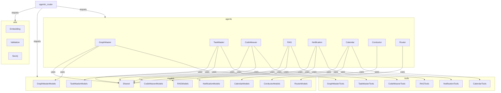

# Mainza Agentic Backend Refactor Plan

---

## 1. Executive Summary: Why Refactor?

- **SOTA Maintainability:** The current `agentic.py` is a monolith (1000+ lines), making it hard to reason about, test, or extend. SOTA agentic systems (context7, pydantic-ai) require modular, composable, and testable code.
- **Testability:** Tight coupling of agents, tools, and models makes unit/integration testing difficult.
- **Context7 & Pydantic-AI Compliance:** Best practices recommend clear separation of agent, tool, and model logic, with explicit boundaries and minimal cross-imports.
- **Scalability:** Adding new agents, tools, or orchestration logic is error-prone in the current structure.

---

## 2. Current State: Agent/Tool Coupling Map

- **All agents, tools, models, and system prompts are defined in `agentic.py`**
- **Agents:**
  - `graphmaster_agent` (GraphMaster)
  - `taskmaster_agent` (TaskMaster)
  - `codeweaver_agent` (CodeWeaver)
  - `rag_agent` (RAG)
  - `notification_agent` (Notification)
  - `calendar_agent` (Calendar)
  - `conductor_agent` (Conductor, formerly MCP)
  - `router_agent` (Router)
- **Tools:**
  - Registered as decorators on each agent, but all defined inline in `agentic.py`.
- **Models:**
  - All Pydantic models (inputs/outputs) are defined inline.
- **Endpoints:**
  - All agentic endpoints are in `agentic.py`, tightly coupled to agent/tool logic.
- **Utilities:**
  - Embedding, model validation, and result coercion are inline.

---

## 3. Target Architecture: Modular, SOTA, Context7-Compliant

### Directory Structure

```
backend/
  agents/
    graphmaster.py
    taskmaster.py
    codeweaver.py
    rag.py
    notification.py
    calendar.py
    conductor.py
    router.py
  tools/
    graphmaster_tools.py
    taskmaster_tools.py
    codeweaver_tools.py
    rag_tools.py
    notification_tools.py
    calendar_tools.py
  models/
    graphmaster_models.py
    taskmaster_models.py
    codeweaver_models.py
    rag_models.py
    notification_models.py
    calendar_models.py
    conductor_models.py
    router_models.py
    shared.py
  utils/
    embedding.py
    validation.py
    neo4j.py
  agentic_router.py
  __init__.py
```

- **Each agent** gets its own file in `agents/`, with only its system prompt, agent definition, and tool registration.
- **Each tool** is defined in a `tools/` module, imported and registered in the agent file.
- **All Pydantic models** are in `models/`, grouped by agent/domain.
- **Shared utilities** (embedding, validation, Neo4j connection) are in `utils/`.
- **The FastAPI router** is in `agentic_router.py`, importing agents and exposing endpoints.

### Example (GraphMaster)

- `agents/graphmaster.py`: defines `graphmaster_agent`, imports tools from `tools/graphmaster_tools.py`, models from `models/graphmaster_models.py`.
- `tools/graphmaster_tools.py`: all @graphmaster_agent.tool functions.
- `models/graphmaster_models.py`: GraphQueryInput, GraphQueryOutput, etc.
- `utils/embedding.py`: get_embedding, embedding_model setup.
- `utils/neo4j.py`: driver, connection logic.

---

## 4. Migration Plan: Step-by-Step

1. **Create new directories:** `agents/`, `tools/`, `models/`, `utils/` in `backend/`.
2. **Extract Neo4j/embedding/util logic** to `utils/`.
3. **For each agent:**
   - Move agent definition and system prompt to `agents/{agent}.py`.
   - Move all tools to `tools/{agent}_tools.py`.
   - Move all models to `models/{agent}_models.py`.
   - Update imports to use shared utils/models.
   - Register tools in the agent file.
4. **Refactor endpoints:**
   - Move all agentic endpoints to `agentic_router.py`.
   - Import agents and models as needed.
   - Expose a single FastAPI router for inclusion in `main.py`.
5. **Update tests and docs:**
   - Update any tests, README, and docs to reference new structure.
6. **Incremental testing:**
   - After each agent/tool is migrated, run tests and validate endpoints.

---

## 5. Gaps, Risks, and Technical Debt

- **Missing Features:**
  - Some tools return dicts, not Pydantic models (should be fixed during migration).
  - Some error handling is inconsistent (should be standardized in utils/validation.py).
- **Technical Debt:**
  - Tight coupling of agent, tool, and endpoint logic.
  - No clear separation of concerns.
- **Context7 Compliance:**
  - Some system prompts and output validation are not fully context7-compliant (should be hardened during migration).
- **Testing:**
  - No explicit unit/integration tests for agents/tools (should be added).

---

## 6. Recommendations: Future-Proofing & SOTA Agentic Design

- **Strict Model Boundaries:** All tools must return Pydantic models, never dicts.
- **Explicit Tool Registration:** Register tools in agent files, not inline.
- **Shared Utilities:** Use utils for embedding, validation, and Neo4j connection.
- **Context7 System Prompts:** Harden all prompts for strict JSON output.
- **Test Coverage:** Add unit/integration tests for each agent/tool.
- **Documentation:** Keep architecture docs (this file) up to date.
- **Extensibility:** New agents/tools can be added by creating new files, not editing a monolith.

---

## Mermaid Diagram: Target Modularization



---

# End of Plan 

## [RENAME NOTE]
- The MCP (Master Control Program) agent has been renamed to Conductor (Orchestration Agent) to avoid confusion with Model Context Protocol and to better reflect its orchestration/crew management function.

- Conductor (Orchestration Agent): receives high-level goals, assembles and coordinates the right agents (GraphMaster, TaskMaster, CodeWeaver, RAG), and ensures the final output is coherent. 