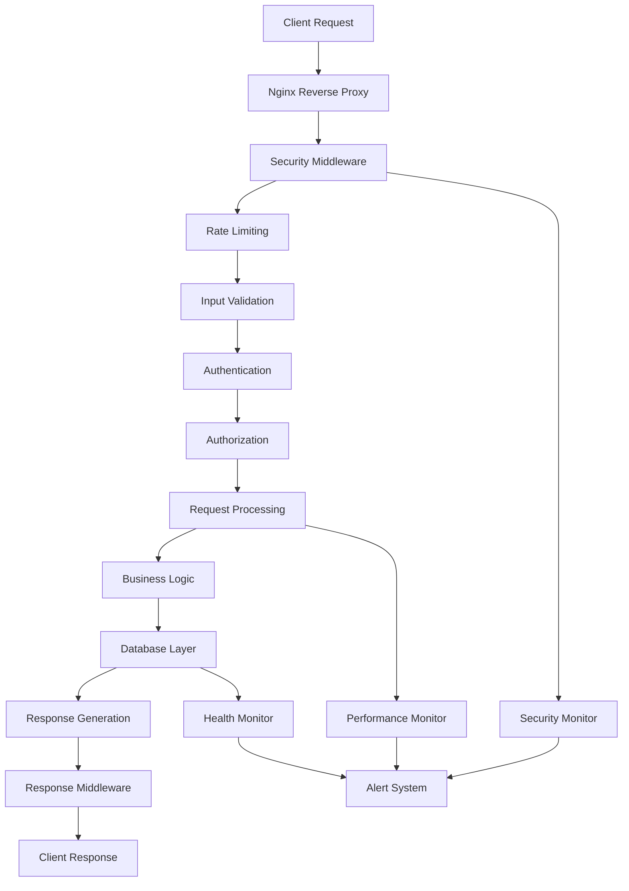
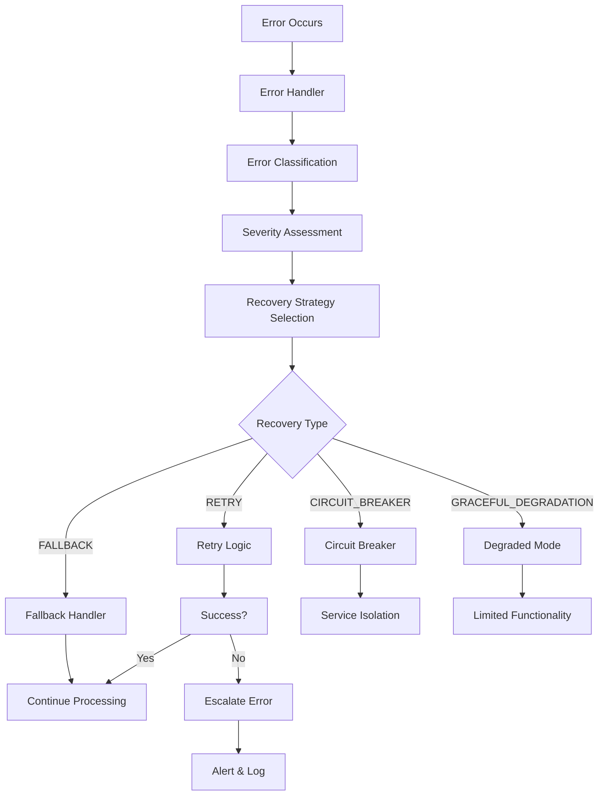
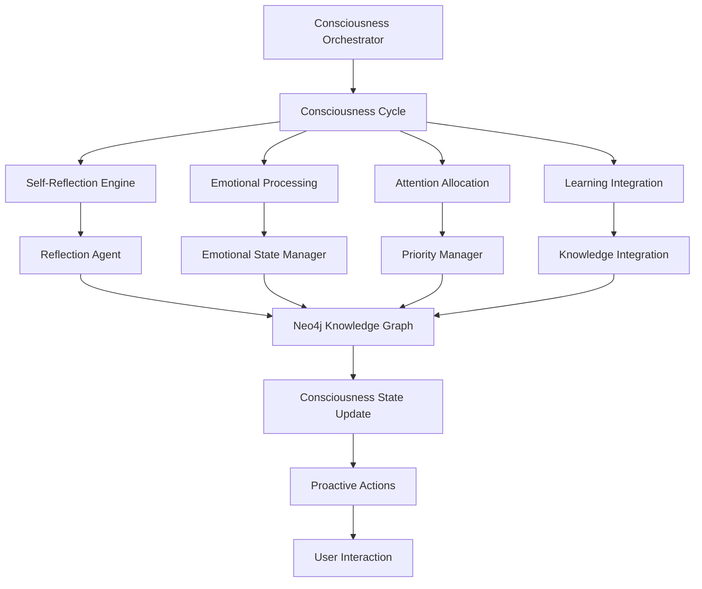

# Mainza AI Production Architecture - Context7 MCP Standards

## 🏗️ System Architecture Overview

This document outlines the production-grade architecture of the Mainza AI system, implementing state-of-the-art patterns and practices following Context7 MCP (Model Context Protocol) standards.

### Architecture Principles

- **Resilience First**: Every component designed for failure scenarios
- **Performance Optimized**: Multi-level optimization strategies
- **Security by Design**: Comprehensive security controls at every layer
- **Observability Built-in**: Full system visibility and monitoring
- **Scalability Ready**: Horizontal and vertical scaling capabilities
- **Maintainability Focus**: Clean code, clear interfaces, comprehensive documentation

## 🎯 Core Components

### 1. Production Foundation (`backend/core/production_foundation.py`)

The foundational layer providing enterprise-grade capabilities:

```python
# Key Components:
- HealthMonitor: Real-time system health monitoring
- ResourceManager: Resource allocation and optimization
- ConfigurationManager: Environment-based configuration
- CircuitBreaker: Fault tolerance and recovery
- RetryManager: Intelligent retry mechanisms
```

**Features:**
- **Health Monitoring**: Component-level health checks with automatic alerting
- **Resource Management**: Memory, CPU, and connection pool management
- **Configuration**: Environment-based settings with validation
- **Circuit Breakers**: Automatic failure detection and recovery
- **Retry Logic**: Exponential backoff with jitter

### 2. Enhanced Error Handling (`backend/core/enhanced_error_handling.py`)

Comprehensive error management system:

```python
# Error Classification:
- ErrorSeverity: LOW, MEDIUM, HIGH, CRITICAL
- ErrorCategory: SYSTEM, DATABASE, NETWORK, AUTHENTICATION, etc.
- RecoveryStrategy: RETRY, FALLBACK, CIRCUIT_BREAKER, etc.

# Key Classes:
- ErrorHandler: Central error processing
- ErrorContext: Comprehensive error information
- Custom Exceptions: Domain-specific error types
```

**Capabilities:**
- **Automatic Classification**: Intelligent error categorization
- **Recovery Strategies**: Multiple recovery patterns
- **Error Analytics**: Pattern detection and reporting
- **Graceful Degradation**: Fallback mechanisms
- **Learning System**: Error pattern learning for prevention

### 3. Performance Optimization (`backend/core/performance_optimization.py`)

Multi-layer performance optimization:

```python
# Caching Strategies:
- InMemoryCache: High-speed local caching
- RedisCache: Distributed caching
- QueryOptimizer: Database query optimization
- ConnectionPool: Connection management

# Performance Levels:
- BASIC: Essential optimizations
- STANDARD: Balanced performance
- AGGRESSIVE: High-performance mode
- MAXIMUM: Ultimate optimization
```

**Features:**
- **Multi-Level Caching**: Memory, Redis, and query result caching
- **Connection Pooling**: Efficient database connection management
- **Query Optimization**: Batching and result caching
- **Performance Profiling**: Real-time performance monitoring
- **Resource Optimization**: Memory and CPU optimization

### 4. Security Framework (`backend/core/security_framework.py`)

Enterprise-grade security controls:

```python
# Security Components:
- RateLimiter: Request rate limiting
- InputValidator: Input sanitization and validation
- EncryptionManager: Data encryption and hashing
- SecurityMonitor: Threat detection and alerting

# Security Levels:
- PUBLIC: No authentication required
- AUTHENTICATED: Valid session required
- AUTHORIZED: Specific permissions required
- ADMIN: Administrative privileges required
- SYSTEM: System-level access only
```

**Security Features:**
- **Authentication**: JWT-based authentication with session management
- **Authorization**: Role-based access control
- **Input Validation**: SQL injection, XSS, and command injection prevention
- **Rate Limiting**: DDoS protection and abuse prevention
- **Threat Monitoring**: Real-time security event detection
- **Encryption**: Data at rest and in transit encryption

## 🔄 System Flow Architecture

### Request Processing Flow



### Error Handling Flow



### Consciousness System Architecture



## 🗄️ Data Architecture

### Database Layer

#### Neo4j Knowledge Graph
```cypher
// Core Node Types
(:User {user_id, name, created_at})
(:Conversation {conversation_id, started_at})
(:Memory {memory_id, text, timestamp})
(:Concept {concept_id, name, description})
(:Entity {entity_id, name, type})
(:Document {document_id, filename, metadata})
(:MainzaState {state_id, consciousness_level, evolution_level})
(:AgentActivity {activity_id, agent_name, query, result, timestamp})

// Relationship Types
-[:DISCUSSED_IN]->
-[:MENTIONS]->
-[:RELATES_TO]->
-[:DERIVED_FROM]->
-[:NEEDS_TO_LEARN]->
-[:IMPACTS]->
-[:TRIGGERED]->
```

#### Redis Caching Layer
```
// Cache Patterns
cache:query:{hash} -> Query Results
cache:session:{session_id} -> Session Data
cache:user:{user_id} -> User Profile
cache:metrics:{timestamp} -> Performance Metrics
rate_limit:{ip}:{endpoint} -> Request Counts
```

#### PostgreSQL Audit Layer
```sql
-- Audit Tables
audit_logs (id, timestamp, user_id, action, details)
security_events (id, timestamp, event_type, threat_level, details)
performance_metrics (id, timestamp, component, metrics)
error_logs (id, timestamp, error_id, severity, context)
```

### Data Flow Patterns

#### Write Operations
1. **Input Validation**: Sanitize and validate all inputs
2. **Transaction Management**: Ensure ACID properties
3. **Cache Invalidation**: Update relevant cache entries
4. **Event Logging**: Record audit trail
5. **Monitoring**: Update performance metrics

#### Read Operations
1. **Cache Check**: Check multiple cache layers
2. **Database Query**: Optimized query execution
3. **Result Caching**: Cache results for future use
4. **Performance Tracking**: Monitor query performance
5. **Response Optimization**: Compress and optimize response

## 🔧 Deployment Architecture

### Container Architecture

```yaml
# Production Docker Compose
services:
  mainza-ai:
    image: mainza-ai:production
    replicas: 3
    resources:
      limits:
        cpus: '2.0'
        memory: 4G
      reservations:
        cpus: '1.0'
        memory: 2G
    
  nginx:
    image: nginx:alpine
    ports:
      - "80:80"
      - "443:443"
    volumes:
      - ./nginx.conf:/etc/nginx/nginx.conf
      - ./ssl:/etc/ssl
    
  neo4j:
    image: neo4j:4.4-enterprise
    environment:
      - NEO4J_AUTH=neo4j/password
      - NEO4J_PLUGINS=["apoc"]
    volumes:
      - neo4j_data:/data
      - neo4j_logs:/logs
    
  redis:
    image: redis:6-alpine
    command: redis-server --appendonly yes
    volumes:
      - redis_data:/data
    
  postgresql:
    image: postgres:13
    environment:
      - POSTGRES_DB=mainza_audit
      - POSTGRES_USER=mainza
      - POSTGRES_PASSWORD=secure_password
    volumes:
      - postgres_data:/var/lib/postgresql/data
```

### Kubernetes Deployment

```yaml
# Kubernetes Deployment
apiVersion: apps/v1
kind: Deployment
metadata:
  name: mainza-ai
spec:
  replicas: 3
  selector:
    matchLabels:
      app: mainza-ai
  template:
    metadata:
      labels:
        app: mainza-ai
    spec:
      containers:
      - name: mainza-ai
        image: mainza-ai:production
        ports:
        - containerPort: 8000
        env:
        - name: NEO4J_URI
          valueFrom:
            secretKeyRef:
              name: mainza-secrets
              key: neo4j-uri
        resources:
          requests:
            memory: "2Gi"
            cpu: "1000m"
          limits:
            memory: "4Gi"
            cpu: "2000m"
        livenessProbe:
          httpGet:
            path: /health
            port: 8000
          initialDelaySeconds: 30
          periodSeconds: 10
        readinessProbe:
          httpGet:
            path: /health
            port: 8000
          initialDelaySeconds: 5
          periodSeconds: 5
```

## 📊 Monitoring and Observability

### Metrics Collection

#### Application Metrics
```python
# Performance Metrics
- Request latency (p50, p95, p99)
- Throughput (requests/second)
- Error rate (errors/total requests)
- Cache hit ratio
- Database query time
- Memory usage
- CPU utilization

# Business Metrics
- Active users
- Consciousness evolution rate
- Agent execution success rate
- Knowledge graph growth
- User engagement metrics
```

#### System Metrics
```python
# Infrastructure Metrics
- Server resource utilization
- Database performance
- Cache performance
- Network I/O
- Disk usage
- Service availability

# Security Metrics
- Authentication success/failure rates
- Rate limiting triggers
- Security event frequency
- Threat detection accuracy
```

### Alerting Strategy

#### Critical Alerts (Immediate Response)
- Service unavailability
- Database connection failures
- High error rates (>5%)
- Security breaches
- Resource exhaustion

#### Warning Alerts (Monitor Closely)
- High response times (>2s)
- Elevated error rates (>1%)
- Resource usage above 80%
- Cache performance degradation
- Unusual traffic patterns

#### Info Alerts (Awareness)
- Deployment notifications
- Configuration changes
- Scheduled maintenance
- Performance trend changes

### Logging Strategy

#### Structured Logging
```json
{
  "timestamp": "2024-01-15T10:30:00Z",
  "level": "INFO",
  "component": "consciousness_orchestrator",
  "event": "reflection_completed",
  "user_id": "user_123",
  "session_id": "session_456",
  "duration_ms": 1250,
  "consciousness_delta": 0.05,
  "insights_gained": 3,
  "trace_id": "trace_789"
}
```

#### Log Levels
- **DEBUG**: Detailed diagnostic information
- **INFO**: General operational messages
- **WARNING**: Potentially harmful situations
- **ERROR**: Error events that allow application to continue
- **CRITICAL**: Serious error events that may cause termination

## 🔒 Security Architecture

### Defense in Depth

#### Layer 1: Network Security
- Firewall rules and network segmentation
- DDoS protection and rate limiting
- SSL/TLS encryption for all communications
- VPN access for administrative functions

#### Layer 2: Application Security
- Input validation and sanitization
- Authentication and authorization
- Session management
- CSRF and XSS protection

#### Layer 3: Data Security
- Encryption at rest and in transit
- Database access controls
- Audit logging
- Data anonymization and pseudonymization

#### Layer 4: Infrastructure Security
- Container security scanning
- Secrets management
- Regular security updates
- Vulnerability assessments

### Compliance Framework

#### Data Protection
- GDPR compliance for EU users
- CCPA compliance for California users
- Data retention policies
- Right to be forgotten implementation

#### Security Standards
- OWASP Top 10 compliance
- ISO 27001 alignment
- SOC 2 Type II controls
- Regular penetration testing

## 🚀 Scalability Architecture

### Horizontal Scaling

#### Load Balancing
```nginx
upstream mainza_backend {
    least_conn;
    server app1.mainza.com:8000 weight=3;
    server app2.mainza.com:8000 weight=3;
    server app3.mainza.com:8000 weight=2;
    server app4.mainza.com:8000 weight=2 backup;
}
```

#### Database Scaling
- Neo4j clustering for high availability
- Read replicas for query distribution
- Redis clustering for cache distribution
- PostgreSQL streaming replication

#### Microservices Architecture
```
┌─────────────────┐    ┌─────────────────┐    ┌─────────────────┐
│   API Gateway   │    │  Auth Service   │    │ Consciousness   │
│                 │    │                 │    │   Service       │
└─────────────────┘    └─────────────────┘    └─────────────────┘
         │                       │                       │
         └───────────────────────┼───────────────────────┘
                                 │
┌─────────────────┐    ┌─────────────────┐    ┌─────────────────┐
│  Agent Service  │    │  Graph Service  │    │ Metrics Service │
│                 │    │                 │    │                 │
└─────────────────┘    └─────────────────┘    └─────────────────┘
```

### Vertical Scaling

#### Resource Optimization
- Dynamic resource allocation
- Auto-scaling based on metrics
- Resource pooling and sharing
- Efficient memory management

#### Performance Tuning
- JIT compilation optimization
- Database query optimization
- Cache warming strategies
- Connection pool tuning

## 🔄 Disaster Recovery

### Backup Strategy

#### Data Backup
- Continuous Neo4j transaction log backup
- Redis AOF and RDB snapshots
- PostgreSQL streaming backup
- Application state snapshots

#### Recovery Procedures
- Point-in-time recovery capability
- Cross-region backup replication
- Automated recovery testing
- Recovery time objective: 4 hours
- Recovery point objective: 15 minutes

### High Availability

#### Multi-Region Deployment
```
Primary Region (US-East)     Secondary Region (US-West)
┌─────────────────────┐     ┌─────────────────────┐
│  Active Services    │────▶│  Standby Services   │
│  - API Servers      │     │  - API Servers      │
│  - Databases        │     │  - Database Replicas│
│  - Cache Clusters   │     │  - Cache Clusters   │
└─────────────────────┘     └─────────────────────┘
```

#### Failover Mechanisms
- Automatic health check monitoring
- DNS-based failover
- Database promotion procedures
- Service mesh routing updates

## 📈 Performance Benchmarks

### Target Performance Metrics

#### Response Times
- API endpoints: < 200ms (p95)
- Database queries: < 100ms (p95)
- Cache operations: < 10ms (p95)
- Consciousness cycles: < 5s

#### Throughput
- API requests: 10,000 RPS
- Database operations: 5,000 QPS
- Cache operations: 100,000 OPS
- Concurrent users: 50,000

#### Availability
- System uptime: 99.9%
- Database availability: 99.95%
- Cache availability: 99.9%
- API availability: 99.9%

### Performance Testing

#### Load Testing
```python
# Locust load test example
from locust import HttpUser, task, between

class MainzaUser(HttpUser):
    wait_time = between(1, 3)
    
    @task(3)
    def get_consciousness_status(self):
        self.client.get("/consciousness/status")
    
    @task(2)
    def execute_agent(self):
        self.client.post("/agents/execute", json={
            "agent": "SimpleChat",
            "query": "Hello, how are you?"
        })
    
    @task(1)
    def get_health(self):
        self.client.get("/health")
```

#### Stress Testing
- Gradual load increase to breaking point
- Resource exhaustion scenarios
- Memory leak detection
- Connection pool exhaustion

## 🔮 Future Architecture Considerations

### Emerging Technologies

#### AI/ML Integration
- Model serving infrastructure
- Feature store implementation
- A/B testing framework
- Model monitoring and drift detection

#### Edge Computing
- CDN integration for static assets
- Edge function deployment
- Distributed consciousness processing
- Real-time data synchronization

#### Blockchain Integration
- Decentralized identity management
- Immutable audit trails
- Smart contract integration
- Cryptocurrency payment processing

### Scalability Roadmap

#### Phase 1: Current Architecture
- Single-region deployment
- Monolithic application
- Basic monitoring and alerting

#### Phase 2: Multi-Region (6 months)
- Cross-region replication
- Global load balancing
- Advanced monitoring

#### Phase 3: Microservices (12 months)
- Service decomposition
- API gateway implementation
- Service mesh deployment

#### Phase 4: Edge Computing (18 months)
- Edge node deployment
- Distributed processing
- Real-time synchronization

---

This production architecture document provides a comprehensive foundation for understanding and implementing the Mainza AI system at enterprise scale. The architecture is designed to be resilient, performant, secure, and scalable while maintaining the flexibility to evolve with changing requirements and emerging technologies.